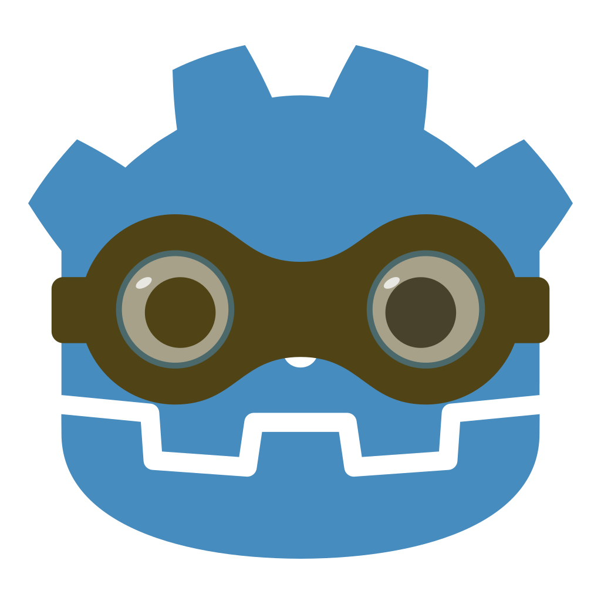

# Godot Modding

## About
So I was playing a game earlier, and wanted to mod it, but also that would be hard to distribute, so I decided to make my own modding platform. My goals for this is to have both in-game support and injected support for mods.
## Repos
[loader](https://github.com/Godot-Modding/loader)
The bread and butter - this is what loads the mods to your Godot game.

[injector](https://github.com/Godot-Modding/injector)
This, like the name implies, injects the loader into a game without support.

[editor](https://github.com/Godot-Modding/editor)
This is the most currently unsure -- an in-game editor for easier mod creation.

[example mod](https://github.com/Godot-Modding/example-mod)
This is an example mod for the loader.

[Godot-Modding.github.io](https://github.com/Godot-Modding/Godot-Modding.github.io)
This is the website for Godot Modding.

###### This is a completely separate organization and project to [GodotModding](https://github.com/GodotModding). They may be who you're looking for.
